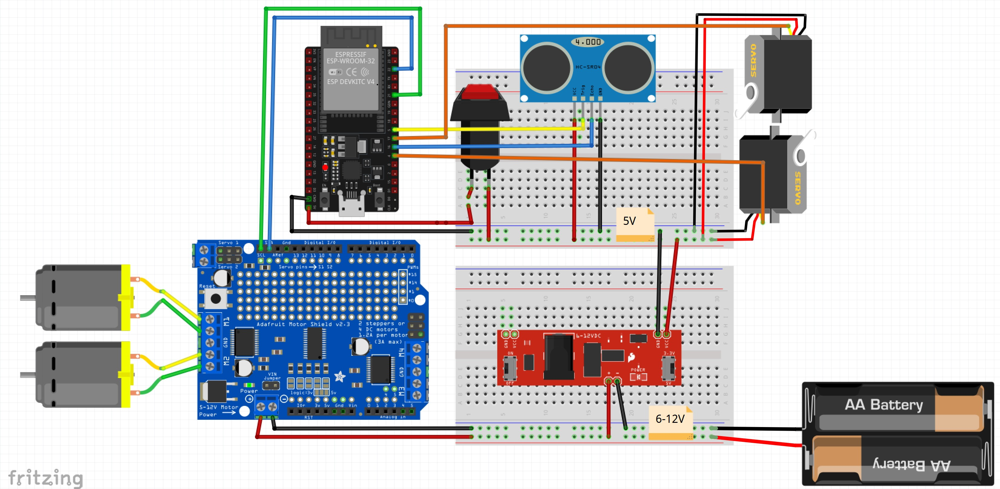

# Claustrophobic Robot

## Overview
The Claustrophobic Robot is my attempt to capture what it might feel like for a machine to experience fear. It’s a robot built to navigate its environment, but when the walls close in and its space gets too tight, it starts to panic.
Using sensors, motors, and servos, the robot reacts to its surroundings in ways that mimic living things. At first, it moves forward calmly, trying to find a clear path. But when it gets too close to an obstacle, it freezes, spins, and eventually spirals into a frantic state: its servos flailing, its buzzer screeching, its motions showing that it is trapped.

## Creative Concept
Throughout this semester, I have been interested in how simple behaviors performed by an object can make it appear alive. Through giving the robot claustrophobic behavior, it becomes very easy to identify and even empathize with the robot and want to free it from its trap. This project gives a machine a personality and the idea of vulnerability. The servos act as its “arms,” moving smoothly when it’s calm and jerking erratically when it’s overwhelmed. The way it turns and stops feels like it’s trying to escape something it.

The Claustrophobic Robot is a machine, but with very simple motions, it reacts in ways that feel human. So much so that when it is panicing, people want to stop and help.

## Installation and Usage

### Requirements
- **Hardware:**
  - ESP32 microcontroller
  - Adafruit Motor Shield v2
  - Ultrasonic distance sensor
  - Servo motors (2x)
  - DC motors (2x)
- **Software:**
  - Arduino IDE
  - Adafruit Motor Shield library
  - ESP32Servo library

### Installation
1. **Download the Code from the Github Repository**
   - Use this link: https://github.com/PM8686/CS334/tree/main/m6_FinalProject
2. **Open the Code in Arduino IDE:**
   - Navigate to the `final` directory and open the `.ino` file.
3. **Install Dependencies:**
   - Ensure the required libraries (Adafruit Motor Shield, ESP32Servo) are installed in Arduino IDE.
4. **Upload Code:**
   - Connect the ESP32 via USB and upload the code to the microcontroller.

### Usage
1. Assemble the hardware components as per the wiring instructions in the code comments and the circuit diagram below.
2. Power on the robot and place it in an open space.
3. Observe its behavior as it navigates its surroundings and reacts to tight spaces.

## Technical Details

### Features
- **Navigation:** The robot moves forward, searching for a clear path using its ultrasonic distance sensor.
- **Obstacle Avoidance:** When detecting an obstacle within 15 cm, it turns left to find a new path.
- **Panic Mode:** After multiple failed attempts to escape, the robot enters a "panic" state, with erratic movements and sound effects.
- **Lifelike Motion:** Two servos simulate "arms" that move calmly when navigating but jerk erratically during panic.

### File Structure
- **final**: This directory contains the final version of the code for the robot
   - `final.ino` - Main Arduino code for robot behavior.
   - `melodies.h` - (Optional) File for storing sound patterns for the buzzer.
   - `pitches.h` - (Optional) File for tone definitions used by the buzzer.
- **test_components**: This directory contains subdirectories and files used to test individual components of the robot.
Each subdirectory includes relevant `.ino` files and additional supporting files (if needed). These tests ensure all components function as expected before integrating them into the main project.
   - `Blink_ESP32` - Contains a basic example to test blinking an LED using the ESP32 microcontroller.  
   - `button` - Code to test button input functionality.  
   - `buzzer` - Code to test buzzer tones and sound output.  
   - `DistSensor` - Code to test the ultrasonic distance sensor for measuring proximity.  
   - `I2C_test` - Example code for testing communication with I2C devices.  
   - `LSM6DS3_gyro` - Example for testing the LSM6DS3 gyroscope sensor functionality.  
   - `Motor` - Code to test the basic operation of a DC motor.  
   - `MotorShield_DCmotors` - Example code to control DC motors using the Adafruit Motor Shield.  
   - `MPU6050_gyro` - Code to test the MPU6050 gyroscope sensor.  
   - `Servo` - Code to test servo motor functionality.  
   - `switch` - Code to test functionality for switch inputs.  
   - `turn` - Code to test the turning logic for the robot's movement.  

### States
1. **Normal:** Calm forward motion.
2. **Turning:** Adjusting direction to avoid obstacles.
3. **Panic:** Erratic movements searching for a way out.

### Circuit Diagram

## Videos
- **Live Demo:**  
  [YouTube Link](https://youtu.be/7eodidrG3LI)
